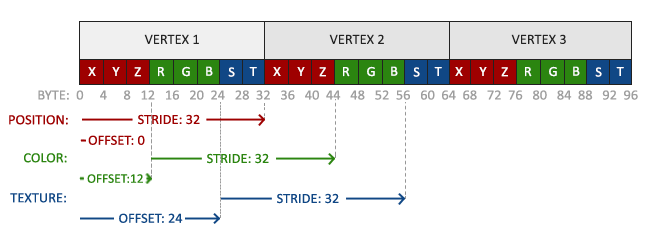

# OpenGLBunny

## What is OpenGL?

OpenGL is a specification about how to render stuff. OpenGL "more or less comes with the system"

[Video: What is OpenGL](https://www.youtube.com/watch?v=Z9pnmnckcFs)

### View OpenGL protocol Version in your machine
```
sudo apt-get install mesa-utils
glxinfo | grep "OpenGL version"
OpenGL version string: 4.6.0 NVIDIA 460.91.03
```

These are not important.

### OpenGL Loading Library

[OpenGL Loading Library](https://www.khronos.org/opengl/wiki/OpenGL_Loading_Library): An OpenGL Loading Library is a library that loads pointers to OpenGL functions at runtime, core as well as extensions. This is required to access functions from OpenGL versions above 1.1 on most platforms. Extension loading libraries also abstracts away the difference between the loading mechanisms on different platforms. Most extension loading libraries override the need to include `gl.h` (the actual openGL specification file) at all. Instead, they provide their own header that must be used. Most extension loading libraries use code generation to construct the code that loads the function pointers and the included headers.

[GLEW](http://glew.sourceforge.net/): GLEW provides efficient run-time mechanisms for determining which OpenGL extensions are supported on the target platform.
- provides access to all GL entrypoints
- supports Windows, MacOS X, Linux, and FreeBSD.
- you should not include `gl.h`, `glew.h` replaced it

[GLAD](https://github.com/Dav1dde/glad): doing code generation and generate a loader from [this website](https://glad.dav1d.de/). This [article](https://stackoverflow.com/questions/68821088/if-i-use-glad-and-not-glew-will-i-miss-on-something) explains `GLAD`

## Installing Environment

### Installing GLFW
For `#include<GLFW/glfw3.h>` to run successfully, we need to install additional package in Ubuntu 18.04. According to [This Github Issue](https://github.com/glfw/glfw/issues/808) and [This blog](https://shnoh171.github.io/gpu%20and%20gpu%20programming/2019/08/26/installing-glfw-on-ubuntu.html), we should install through the following command (if you are too lazy to build it from source):

[GLFW](https://en.wikipedia.org/wiki/GLFW): a library for managing windows and OpenGL contexts, as well as handle joystick, keyboard and mouse input.

```
sudo apt-get install libglfw3 libglfw3-dev

The following additional packages will be installed:
  libllvm10 libvulkan-dev libvulkan1 mesa-vulkan-drivers
The following NEW packages will be installed:
  libglfw3-dev libllvm10 libvulkan-dev mesa-vulkan-drivers
The following packages will be upgraded:
  libvulkan1
```

## Installing GLM
For `#include<glm/glm.hpp> #include<glm/ext.hpp>`, we need `sudo apt install libglm-dev`. [GLM](https://github.com/g-truc/glm) is a library that provide us matrix to work with.


### Configure VSCode

To configure `#include<glad/glad.h>`, change it to `#include "include/glad/glad.h"`

Automate Build Process
1. `Ctrl` + `Shift` + `P` to launch `Tasks: Configure Default Build Task` and we choose `g++`.
2. See `tasks.json` for detail how to configure this file. This is so that we can automate the build process

Let VSCode Recognize include, we create a file `./.vscode/c_cpp_properties.json` and add

```json
{
    "configurations": [
        {
            "name": "Linux",
            "includePath": [
              "${workspaceFolder}/**",
              // "${workspaceFolder}/include/**", // we actually don't need this line
              // since we used `#include "include/glad/glad.h"` instead of `#include<glad/glad.h>`
            ],
            "defines": [],
            "compilerPath": "/usr/bin/g++-7",
            "cStandard": "c11",
            "cppStandard": "c++14",
            "intelliSenseMode": "linux-clang-x64"
        }
    ],
    "version": 4
}
```

### Installing GLAD
To install GLAD:
- go to [this website](https://glad.dav1d.de/)
- I choose `gl=4.6` (this correspond code `glfwWindowHint(GLFW_CONTEXT_VERSION_MAJOR, 4); glfwWindowHint(GLFW_CONTEXT_VERSION_MINOR, 6);`), `C/C++ deubg`, `core` (core constans modern library while compatibility constains very old, deprecated versions, therefore not recommended)

Note: you could use `pip` or `vcpkg` (they are package manager) to install `GLAD`, but what you installed is a generator, not a executable or code source. So don't do that.

How your project file should look like this. Notice `GLAD` is in `./include` which we specify to let VSCode detect in `./.vscode/c_cpp_properties.json`. Here is a good [article](https://rpxomi.github.io/) that teaches you how to include things.

Put what you get into the folders like below:

```tree
.
├── build
├── glad.c
├── include
│   ├── glad
│   │   └── glad.h
│   └── KHR
│       └── khrplatform.h
├── lib
├── main.cpp
└── README.md
```

Now you can build your program by `Ctrl` + `Shift` + `P` to launch `Tasks: Run build Task`. With `tasks.json` set up like the following. You might need to restart VSCode for `tasks.json` to take effect.

```json
{
	"version": "2.0.0",
	"tasks": [
    {
      "type": "cppbuild",
      "label": "Building main.cpp using C/C++: g++-7 build active file",
      "command": "/usr/bin/g++-7",
      "args": [
        "-fdiagnostics-color=always",
        "-g", // telling g++ using debug mode
        "./main.cpp", // main.cpp
        "glad.c",
        "-I",
        "./include", // GLAD
        "-lglfw", // GLFW
        "-lGL", // OpenGL
        "-ldl", // dynamic linking loader
        "-o", "./build/a.out",
      ],
      "options": {
        "cwd": "${fileDirname}"
      },
      "problemMatcher": [
        "$gcc"
      ],
      "group": {
        "kind": "build",
        "isDefault": true
      },
      "detail": "compiler: /usr/bin/g++-7"
    }
  ]
}
```

## OpenGL Concepts

